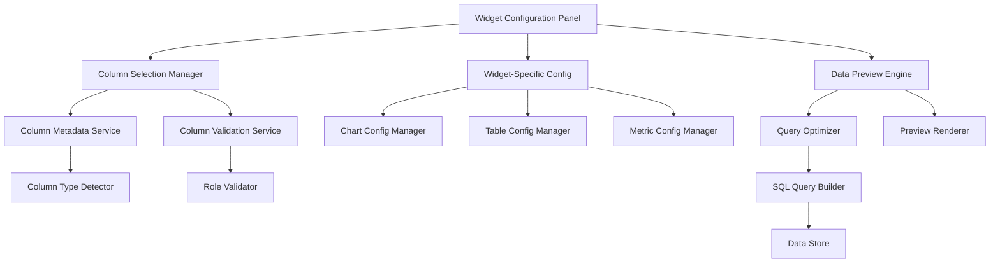

# Design Document

## Overview

This design implements an advanced widget column mapping and configuration system that provides granular control over data visualization. The solution leverages the existing Recharts-based chart capabilities (which already support multi-series rendering) and focuses on enhancing the configuration UI, implementing column selection, optimizing query generation, and adding robust fallback mechanisms. The architecture maintains backward compatibility while exposing the sophisticated visualization capabilities already present in the rendering layer.

## Current Capabilities Assessment

### Existing Chart Widget Strengths
The current ChartWidget implementation already has excellent multi-series support:

1. **Multi-Series Rendering**: The `yKeys.map()` logic already renders multiple Y columns as separate series
2. **Recharts Integration**: Uses Recharts library which provides robust multi-series, stacking, and grouping
3. **Color Management**: Has color schemes and automatic color assignment for multiple series
4. **Stacking Support**: Area charts already implement stacking with `stackId="1"`
5. **Legend and Tooltips**: Already handle multiple series properly

### Current Limitations
The main gaps are in the **configuration interface**, not the rendering:

1. **Single Column Selection**: UI only allows selecting one `xColumn` and `yColumn`
2. **No Column Filtering**: Always uses `SELECT *` and shows all columns
3. **Limited Chart Configuration**: No UI for stacking modes, aggregation, or series selection
4. **No Column Metadata**: No type detection or role suggestions

### Table Widget Capabilities
The TableWidget already has:
1. **Sorting and Filtering**: Full implementation with search and column sorting
2. **Pagination**: Configurable page sizes
3. **Export Functionality**: CSV export capability
4. **Responsive Design**: Proper scrolling and mobile support

### Design Focus
This design focuses on **enhancing configuration capabilities** rather than rebuilding rendering logic.

## Architecture

### Core Components



### Data Flow

1. **Configuration Phase**: User selects columns and configures widget-specific options
2. **Validation Phase**: System validates column selections against widget requirements
3. **Query Generation Phase**: Optimized SQL queries are generated based on selected columns
4. **Preview Phase**: Mock data and visualizations are rendered for user validation
5. **Execution Phase**: Final queries are executed and widgets are rendered

## Components and Interfaces

### 1. Enhanced Widget Configuration Types

```typescript
// Extended WidgetConfig interface - building on existing structure
interface EnhancedWidgetConfig extends WidgetConfig {
  // Column Selection - core new functionality
  selectedColumns?: string[];
  columnMappings?: ColumnMapping[];
  columnFormatting?: ColumnFormatting[];
  
  // Chart Enhancements - leveraging existing Recharts capabilities
  yColumns?: string[]; // Extend existing yColumn to support multiple
  stackingMode?: 'grouped' | 'stacked'; // Make existing area stacking configurable
  aggregationOptions?: AggregationConfig[];
  
  // Table Enhancements - building on existing table features
  columnOrder?: string[];
  hiddenColumns?: string[];
  columnWidths?: Record<string, number>;
  
  // Metric Enhancements - extend existing metric functionality
  multipleMetrics?: MetricConfig[];
  comparisonMetrics?: ComparisonConfig[];
  
  // Performance & Fallbacks
  queryOptimization?: boolean;
  fallbackBehavior?: 'default' | 'error' | 'warning';
  maxDataRows?: number;
  maxSeriesCount?: number;
}

interface ColumnMapping {
  sourceColumn: string;
  role: ColumnRole;
  displayName?: string;
  dataType?: DataType;
  formatting?: ColumnFormat;
}

interface ColumnFormatting {
  column: string;
  type: 'currency' | 'percentage' | 'date' | 'number';
  options?: FormatOptions;
}

interface AggregationConfig {
  column: string;
  function: 'sum' | 'avg' | 'count' | 'min' | 'max';
  alias?: string;
}

type ColumnRole = 'x-axis' | 'y-axis' | 'series' | 'metric' | 'display' | 'filter';
type DataType = 'numeric' | 'categorical' | 'date' | 'text' | 'boolean';
```

### 2. Column Selection Manager

```typescript
class ColumnSelectionManager {
  private availableColumns: ColumnMetadata[];
  private selectedColumns: string[];
  private columnMappings: Map<string, ColumnMapping>;
  
  constructor(
    private dataSource: string,
    private metadataService: ColumnMetadataService
  ) {}
  
  async loadAvailableColumns(): Promise<ColumnMetadata[]> {
    // Load columns from data source with metadata
    const columns = await this.metadataService.getColumns(this.dataSource);
    return columns.map(col => ({
      ...col,
      dataType: this.detectDataType(col),
      suggestedRoles: this.suggestRoles(col)
    }));
  }
  
  selectColumns(columns: string[]): void {
    this.selectedColumns = columns;
    this.validateSelections();
  }
  
  mapColumnToRole(column: string, role: ColumnRole, options?: MappingOptions): void {
    this.columnMappings.set(column, {
      sourceColumn: column,
      role,
      displayName: options?.displayName,
      formatting: options?.formatting
    });
  }
  
  private validateSelections(): ValidationResult {
    // Validate column selections against widget requirements
    return {
      isValid: true,
      warnings: [],
      errors: []
    };
  }
}
```

### 3. Widget-Specific Configuration Managers

#### Chart Configuration Manager

```typescript
class ChartConfigManager {
  private config: ChartWidgetConfig;
  private columnManager: ColumnSelectionManager;
  
  // The current ChartWidget already supports multiple Y columns in rendering
  // We need to enhance the configuration UI to expose this capability
  configureMultiSeries(yColumns: string[]): void {
    // Update the existing yColumn to be an array or comma-separated string
    // The current rendering logic: yKeys = widget.config.yColumn ? [widget.config.yColumn] : keys.slice(1)...
    // We can extend this to support multiple columns
    this.config.yColumns = yColumns; // New field
    this.config.yColumn = yColumns[0]; // Maintain backward compatibility
    this.validateChartConfiguration();
  }
  
  configureStacking(mode: 'grouped' | 'stacked'): void {
    // Area charts already use stackId="1" - we can make this configurable
    this.config.stackingMode = mode;
  }
  
  // Current ChartWidget already handles multiple yKeys in rendering
  // We just need to provide the configuration interface
  private validateChartConfiguration(): ValidationResult {
    const chartType = this.config.chartType;
    const yColumns = this.config.yColumns || [];
    
    switch (chartType) {
      case 'pie':
        return this.validatePieChart(yColumns);
      case 'bar':
      case 'line':
      case 'area':
        // These already work with multiple series in current implementation
        return this.validateMultiSeriesChart(yColumns);
      default:
        return { isValid: true, warnings: [], errors: [] };
    }
  }
  
  private validatePieChart(yColumns: string[]): ValidationResult {
    if (yColumns.length > 1) {
      return {
        isValid: false,
        errors: ['Pie charts support only one value column'],
        warnings: []
      };
    }
    return { isValid: true, warnings: [], errors: [] };
  }
  
  private validateMultiSeriesChart(yColumns: string[]): ValidationResult {
    // Current implementation already supports this via yKeys.map()
    if (yColumns.length > 10) {
      return {
        isValid: false,
        errors: ['Too many series - maximum 10 supported'],
        warnings: []
      };
    }
    return { isValid: true, warnings: [], errors: [] };
  }
}
```

#### Table Configuration Manager

```typescript
class TableConfigManager {
  private config: TableWidgetConfig;
  
  configureColumnOrder(order: string[]): void {
    this.config.columnOrder = order;
  }
  
  configureColumnFormatting(column: string, formatting: ColumnFormat): void {
    if (!this.config.columnFormatting) {
      this.config.columnFormatting = [];
    }
    
    const existing = this.config.columnFormatting.find(f => f.column === column);
    if (existing) {
      Object.assign(existing, formatting);
    } else {
      this.config.columnFormatting.push({ column, ...formatting });
    }
  }
  
  hideColumns(columns: string[]): void {
    this.config.hiddenColumns = columns;
  }
  
  setColumnWidths(widths: Record<string, number>): void {
    this.config.columnWidths = widths;
  }
}
```

### 4. Query Optimizer

```typescript
class QueryOptimizer {
  constructor(
    private baseQuery: string,
    private selectedColumns: string[],
    private computedFields: ComputedField[],
    private vlookupTables: VlookupTable[]
  ) {}
  
  generateOptimizedQuery(): OptimizedQuery {
    try {
      const query = this.buildSelectClause() +
                   this.buildFromClause() +
                   this.buildJoinClauses() +
                   this.buildWhereClause() +
                   this.buildLimitClause();
      
      return {
        query,
        isOptimized: true,
        columnCount: this.selectedColumns.length,
        estimatedPerformance: this.estimatePerformance()
      };
    } catch (error) {
      return this.getFallbackQuery(error);
    }
  }
  
  private buildSelectClause(): string {
    const columns = [];
    
    // Add selected original columns
    if (this.selectedColumns.length > 0) {
      columns.push(...this.selectedColumns.map(col => `"${col}"`));
    } else {
      columns.push('*');
    }
    
    // Add computed fields
    columns.push(...this.computedFields.map(field => 
      `(${field.formula}) AS "${field.name}"`
    ));
    
    // Add VLOOKUP columns
    columns.push(...this.vlookupTables.map(vlookup => 
      `"${vlookup.targetTable}"."${vlookup.returnColumn}" AS "${vlookup.alias}"`
    ));
    
    return `SELECT ${columns.join(', ')} `;
  }
  
  private getFallbackQuery(error: Error): OptimizedQuery {
    console.warn('Query optimization failed, falling back to SELECT *:', error);
    return {
      query: this.baseQuery || 'SELECT * FROM data_source LIMIT 100',
      isOptimized: false,
      fallbackReason: error.message,
      columnCount: -1,
      estimatedPerformance: 'unknown'
    };
  }
}
```

### 5. Data Preview Engine

```typescript
class DataPreviewEngine {
  constructor(
    private queryOptimizer: QueryOptimizer,
    private dataStore: DataStore
  ) {}
  
  async generatePreview(config: WidgetConfig): Promise<PreviewResult> {
    try {
      const optimizedQuery = this.queryOptimizer.generateOptimizedQuery();
      const previewQuery = this.addPreviewLimits(optimizedQuery.query);
      
      const data = await this.dataStore.executeQuery(previewQuery);
      const filteredData = this.applyColumnFiltering(data, config.selectedColumns);
      
      return {
        data: filteredData.slice(0, 10),
        totalRows: data.length,
        columns: this.getColumnInfo(filteredData),
        isOptimized: optimizedQuery.isOptimized,
        warnings: this.generateWarnings(config, filteredData)
      };
    } catch (error) {
      return this.getFallbackPreview(error);
    }
  }
  
  private addPreviewLimits(query: string): string {
    if (!query.toLowerCase().includes('limit')) {
      return `${query} LIMIT 50`;
    }
    return query;
  }
  
  private applyColumnFiltering(data: any[], selectedColumns?: string[]): any[] {
    if (!selectedColumns || selectedColumns.length === 0) {
      return data;
    }
    
    return data.map(row => {
      const filteredRow: any = {};
      selectedColumns.forEach(col => {
        if (row.hasOwnProperty(col)) {
          filteredRow[col] = row[col];
        }
      });
      return filteredRow;
    });
  }
}
```

### 6. Column Metadata Service

```typescript
class ColumnMetadataService {
  async getColumns(dataSource: string): Promise<ColumnMetadata[]> {
    // Implementation to fetch column metadata
    const columns = await this.fetchColumnInfo(dataSource);
    return columns.map(col => ({
      ...col,
      dataType: this.detectDataType(col),
      suggestedRoles: this.suggestRoles(col),
      isComputed: false,
      isVlookup: false
    }));
  }
  
  private detectDataType(column: ColumnInfo): DataType {
    // Analyze sample data to determine type
    if (this.isNumeric(column.sampleValues)) return 'numeric';
    if (this.isDate(column.sampleValues)) return 'date';
    if (this.isCategorical(column.sampleValues)) return 'categorical';
    return 'text';
  }
  
  private suggestRoles(column: ColumnInfo): ColumnRole[] {
    const roles: ColumnRole[] = ['display'];
    
    switch (column.dataType) {
      case 'numeric':
        roles.push('y-axis', 'metric');
        break;
      case 'categorical':
        roles.push('x-axis', 'series');
        break;
      case 'date':
        roles.push('x-axis');
        break;
    }
    
    return roles;
  }
}
```

## Data Models

### Enhanced Widget Configuration Schema

```typescript
interface WidgetConfigurationState {
  // Core configuration
  widget: Widget;
  
  // Column management
  availableColumns: ColumnMetadata[];
  selectedColumns: string[];
  columnMappings: ColumnMapping[];
  
  // Widget-specific state
  chartConfig?: ChartConfiguration;
  tableConfig?: TableConfiguration;
  metricConfig?: MetricConfiguration;
  
  // Preview and validation
  previewData: any[];
  validationResults: ValidationResult[];
  
  // Performance tracking
  queryOptimization: OptimizationState;
  fallbacksUsed: string[];
}

interface ColumnMetadata {
  name: string;
  dataType: DataType;
  suggestedRoles: ColumnRole[];
  sampleValues: any[];
  isComputed: boolean;
  isVlookup: boolean;
  nullable: boolean;
  uniqueValues?: number;
}

interface ChartConfiguration {
  type: ChartType;
  xColumns: string[];
  yColumns: string[];
  seriesColumn?: string;
  stackingMode: 'grouped' | 'stacked';
  aggregations: AggregationConfig[];
  secondaryYAxis: boolean;
  colorMapping: Record<string, string>;
}
```

## Error Handling

### Validation Strategy

1. **Column Selection Validation**
   - Verify selected columns exist in data source
   - Check column data types against widget requirements
   - Validate computed field formulas
   - Ensure VLOOKUP configurations are complete

2. **Configuration Validation**
   - Chart-specific validations (e.g., pie charts with single Y column)
   - Table configuration consistency checks
   - Metric aggregation compatibility

3. **Query Optimization Fallbacks**
   - Fall back to SELECT * if column optimization fails
   - Use client-side filtering as secondary fallback
   - Implement query timeout and retry mechanisms

### Error Recovery

```typescript
class ErrorRecoveryManager {
  handleConfigurationError(error: ConfigurationError): RecoveryAction {
    switch (error.type) {
      case 'INVALID_COLUMN_SELECTION':
        return this.recoverFromInvalidColumns(error);
      case 'QUERY_OPTIMIZATION_FAILED':
        return this.recoverFromQueryFailure(error);
      case 'CHART_CONFIGURATION_INVALID':
        return this.recoverFromChartError(error);
      default:
        return this.getDefaultRecovery(error);
    }
  }
  
  private recoverFromInvalidColumns(error: ConfigurationError): RecoveryAction {
    return {
      action: 'FALLBACK_TO_ALL_COLUMNS',
      message: 'Some selected columns are invalid. Showing all available columns.',
      severity: 'warning'
    };
  }
}
```

## Testing Strategy

### Unit Testing
- Column selection and validation logic
- Query optimization algorithms
- Widget-specific configuration managers
- Error handling and fallback mechanisms

### Integration Testing
- End-to-end widget configuration workflows
- Data preview generation and accuracy
- Query execution with optimized queries
- Cross-widget consistency

### Performance Testing
- Query optimization effectiveness
- Large dataset handling
- Memory usage with multiple columns
- Rendering performance with complex charts

## Implementation Phases

### Phase 1: Core Infrastructure
1. Enhanced type definitions and interfaces
2. Column Selection Manager implementation
3. Basic query optimization
4. Updated widget configuration panel structure

### Phase 2: Widget-Specific Enhancements
1. Chart configuration manager with multi-series support
2. Table configuration manager with column control
3. Metric configuration manager with multiple metrics
4. Enhanced preview system

### Phase 3: Advanced Features
1. Column metadata service and type detection
2. Advanced query optimization
3. Comprehensive error handling and fallbacks
4. Performance optimizations

### Phase 4: Polish and Integration
1. UI/UX improvements and consistency
2. Comprehensive testing and bug fixes
3. Documentation and user guides
4. Performance monitoring and optimization

This design provides a robust, scalable solution that addresses all requirements while maintaining backward compatibility and providing comprehensive fallback mechanisms.