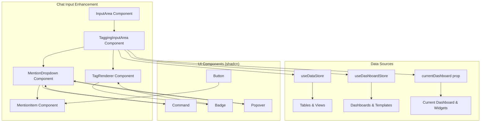

# Design Document

## Overview

This design outlines the implementation of a tagging system for the chat input area that allows users to mention tables, dashboards, and widgets using "@" mentions. The solution will be built as a modular enhancement to the existing InputArea component, using existing shadcn components and following the current design patterns. The implementation will be non-intrusive and maintain backward compatibility with the existing chat functionality.

## Architecture

### High-Level Architecture



### Component Hierarchy

1. **TaggingInputArea**: Enhanced wrapper around existing InputArea
2. **MentionDropdown**: Dropdown component for showing available items to tag
3. **TagRenderer**: Component for rendering tags within the input
4. **MentionItem**: Individual item component in the dropdown
5. **TaggedMessage**: Enhanced message format with tagged content

## Components and Interfaces

### Enhanced InputArea Interface

```typescript
// Enhanced InputArea props to support tagging
interface TaggingInputAreaProps extends InputAreaProps {
  currentDashboard?: Dashboard | null;
  onTaggedMessageSend?: (message: string, tags: TaggedItem[]) => void;
}

// Tagged item structure
interface TaggedItem {
  id: string;
  type: 'table' | 'dashboard' | 'widget' | 'view';
  name: string;
  data: any; // Complete data for the tagged item
  displayText: string;
}

// Mention dropdown item
interface MentionItem {
  id: string;
  type: 'table' | 'dashboard' | 'widget' | 'view';
  name: string;
  description?: string;
  icon: React.ComponentType;
  section: 'tables' | 'current-dashboard' | 'current-widgets' | 'other-dashboards';
  data: any;
}
```

### TaggingInputArea Component

```typescript
// Main component that wraps the existing InputArea
export function TaggingInputArea({
  input,
  setInput,
  handleSend,
  isLoading,
  error,
  currentDashboard,
  onTaggedMessageSend,
  ...props
}: TaggingInputAreaProps) {
  const [showMentions, setShowMentions] = useState(false);
  const [mentionQuery, setMentionQuery] = useState('');
  const [tags, setTags] = useState<TaggedItem[]>([]);
  const [cursorPosition, setCursorPosition] = useState(0);
  
  // Handle @ detection and mention dropdown
  // Handle tag insertion and removal
  // Handle message sending with tags
}
```

### MentionDropdown Component

```typescript
// Dropdown component using shadcn Command
export function MentionDropdown({
  isOpen,
  query,
  onSelect,
  onClose,
  position
}: MentionDropdownProps) {
  const { tables, views } = useDataStore();
  const { dashboards, currentDashboard } = useDashboardStore();
  
  const mentionItems = useMemo(() => {
    // Group items by section
    // Filter based on query
    // Return structured data
  }, [tables, views, dashboards, currentDashboard, query]);
  
  return (
    <Popover open={isOpen} onOpenChange={onClose}>
      <PopoverContent className="w-80 p-0" side="top">
        <Command>
          <CommandList>
            <CommandGroup heading="Tables">
              {/* Table items */}
            </CommandGroup>
            <CommandGroup heading="Current Dashboard">
              {/* Current dashboard item */}
            </CommandGroup>
            <CommandGroup heading="Current Dashboard Widgets">
              {/* Widget items */}
            </CommandGroup>
            <CommandGroup heading="Other Dashboards">
              {/* Other dashboard items */}
            </CommandGroup>
          </CommandList>
        </Command>
      </PopoverContent>
    </Popover>
  );
}
```

### TagRenderer Component

```typescript
// Component for rendering tags within the input
export function TagRenderer({ tag, onRemove }: TagRendererProps) {
  const getTagIcon = (type: string) => {
    switch (type) {
      case 'table': return <Table className="w-3 h-3" />;
      case 'dashboard': return <BarChart3 className="w-3 h-3" />;
      case 'widget': return <Layers className="w-3 h-3" />;
      case 'view': return <Eye className="w-3 h-3" />;
      default: return null;
    }
  };
  
  const getTagVariant = (type: string) => {
    switch (type) {
      case 'table': return 'default';
      case 'dashboard': return 'secondary';
      case 'widget': return 'outline';
      case 'view': return 'default';
      default: return 'default';
    }
  };
  
  return (
    <Badge 
      variant={getTagVariant(tag.type)}
      className="inline-flex items-center gap-1 mx-1 cursor-pointer hover:bg-destructive hover:text-destructive-foreground"
      onClick={onRemove}
    >
      {getTagIcon(tag.type)}
      {tag.displayText}
      <X className="w-3 h-3 ml-1" />
    </Badge>
  );
}
```

## Data Models

### Tag Data Structure

```typescript
// Complete tag data structure
interface TaggedItem {
  id: string;
  type: 'table' | 'dashboard' | 'widget' | 'view';
  name: string;
  displayText: string;
  data: TableData | DashboardData | WidgetData | ViewData;
}

interface TableData {
  id: string;
  name: string;
  type: 'csv' | 'sql';
  columns: string[];
  rowCount: number;
  schema?: Array<{name: string, type: string}>;
  sampleData?: any[];
}

interface DashboardData {
  dashboard: Dashboard;
  status: 'draft' | 'published';
}

interface WidgetData {
  widget: Widget;
  dashboardId: string;
  dashboardName: string;
}

interface ViewData {
  id: string;
  name: string;
  query: string;
  description?: string;
}
```

### Message Enhancement

```typescript
// Enhanced chat message with tagged content
interface TaggedChatMessage extends ChatMessage {
  tags?: TaggedItem[];
  taggedContent?: string; // Formatted content with tag placeholders
}

// Message formatting for AI
interface AIMessageContext {
  message: string;
  taggedTables?: TableData[];
  taggedDashboards?: DashboardData[];
  taggedWidgets?: WidgetData[];
  taggedViews?: ViewData[];
}
```

## Implementation Strategy

### Phase 1: Core Tagging Infrastructure

1. **Create TaggingInputArea Component**
   - Wrap existing InputArea with tagging functionality
   - Implement @ detection and cursor position tracking
   - Handle tag insertion and removal logic

2. **Implement MentionDropdown**
   - Use shadcn Command component for dropdown
   - Group items by section (Tables, Current Dashboard, etc.)
   - Implement filtering and keyboard navigation

3. **Create TagRenderer Component**
   - Use shadcn Badge component for tag display
   - Implement appropriate icons and colors
   - Handle tag removal on click/backspace

### Phase 2: Data Integration

1. **Connect to Data Stores**
   - Integrate with useDataStore for tables and views
   - Integrate with useDashboardStore for dashboards
   - Handle current dashboard and widgets

2. **Implement Data Transformation**
   - Transform store data to MentionItem format
   - Include complete data for AI context
   - Handle edge cases (empty states, loading)

### Phase 3: Message Enhancement

1. **Enhanced Message Sending**
   - Format messages with tagged content
   - Include complete tag data for AI processing
   - Maintain backward compatibility

2. **UI Polish**
   - Implement smooth animations
   - Add loading states
   - Handle responsive design

## Error Handling

### Error Categories

1. **Data Loading Errors**: Store initialization failures
2. **Tag Resolution Errors**: Invalid or missing tagged items
3. **UI State Errors**: Dropdown positioning or keyboard navigation issues
4. **Message Formatting Errors**: Tag serialization/deserialization failures

### Error Handling Strategy

```typescript
// Error boundary for tagging functionality
export function TaggingErrorBoundary({ children }: { children: React.ReactNode }) {
  return (
    <ErrorBoundary
      fallback={<InputArea {...originalProps} />} // Fallback to original InputArea
      onError={(error) => {
        console.error('Tagging error:', error);
        toast.error('Tagging feature temporarily unavailable');
      }}
    >
      {children}
    </ErrorBoundary>
  );
}
```

## Testing Strategy

### Unit Testing

1. **Component Testing**: Test TaggingInputArea, MentionDropdown, TagRenderer
2. **Hook Testing**: Test custom hooks for mention detection and tag management
3. **Utility Testing**: Test data transformation and message formatting functions

### Integration Testing

1. **Store Integration**: Test integration with data and dashboard stores
2. **Message Flow**: Test complete tagging and message sending flow
3. **Keyboard Navigation**: Test dropdown navigation and selection

### User Experience Testing

1. **Performance**: Test with large numbers of tables/dashboards
2. **Accessibility**: Test keyboard navigation and screen reader support
3. **Responsive Design**: Test across different screen sizes

## Migration Strategy

### Backward Compatibility

1. **Non-Breaking Changes**: TaggingInputArea wraps existing InputArea
2. **Gradual Rollout**: Feature can be enabled/disabled via props
3. **Fallback Support**: Graceful degradation to original InputArea on errors

### Implementation Steps

1. **Create New Components**: Build tagging components alongside existing ones
2. **Update InputArea Usage**: Replace InputArea with TaggingInputArea in ChatInterface
3. **Test Integration**: Ensure existing functionality remains intact
4. **Enable Feature**: Activate tagging functionality with feature flag

## Performance Considerations

### Optimization Strategies

1. **Memoization**: Use React.memo and useMemo for expensive computations
2. **Virtual Scrolling**: Implement for large dropdown lists
3. **Debounced Filtering**: Debounce search queries to reduce re-renders
4. **Lazy Loading**: Load tag data only when dropdown is opened

### Memory Management

1. **Tag Data Cleanup**: Clean up tag references when components unmount
2. **Event Listener Cleanup**: Properly remove keyboard and click listeners
3. **Store Subscriptions**: Manage store subscriptions efficiently

## Accessibility

### ARIA Support

1. **Dropdown Navigation**: Proper ARIA labels and roles for dropdown
2. **Tag Interaction**: Accessible tag removal and keyboard navigation
3. **Screen Reader Support**: Descriptive text for tagged items

### Keyboard Support

1. **Arrow Keys**: Navigate dropdown items
2. **Enter/Tab**: Select dropdown items
3. **Escape**: Close dropdown
4. **Backspace**: Remove tags when cursor is adjacent