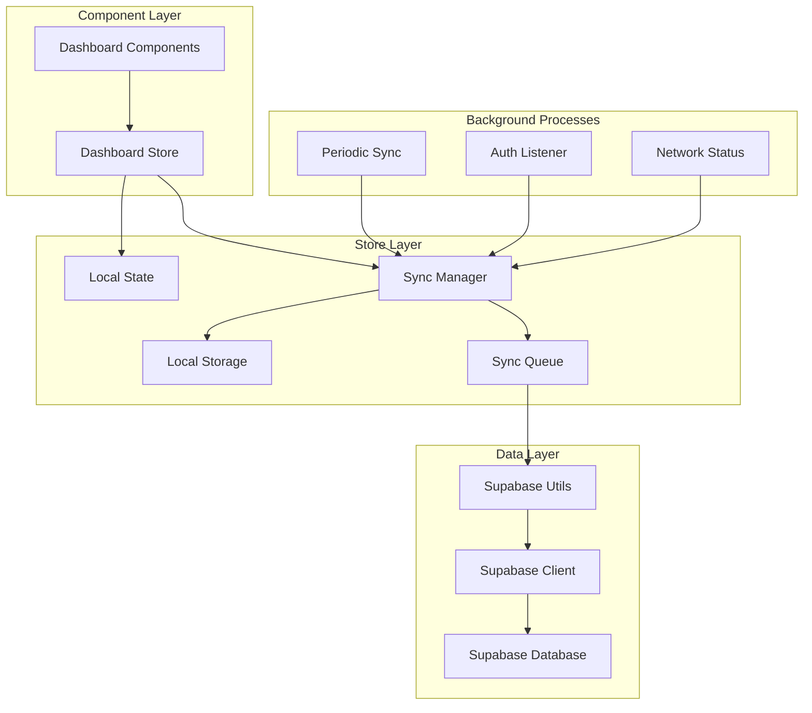
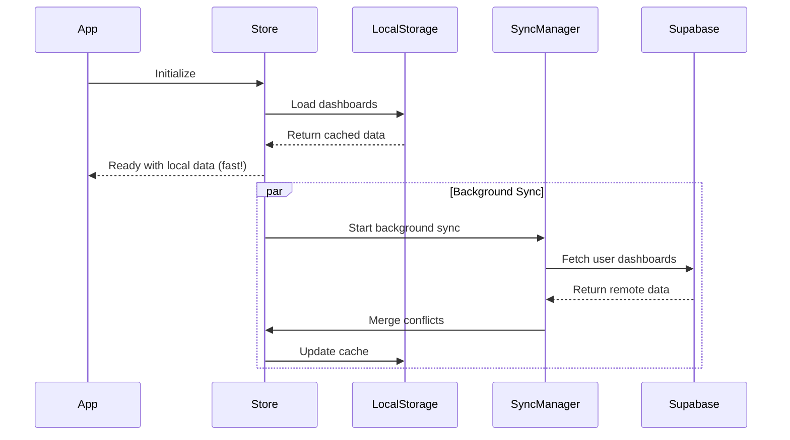
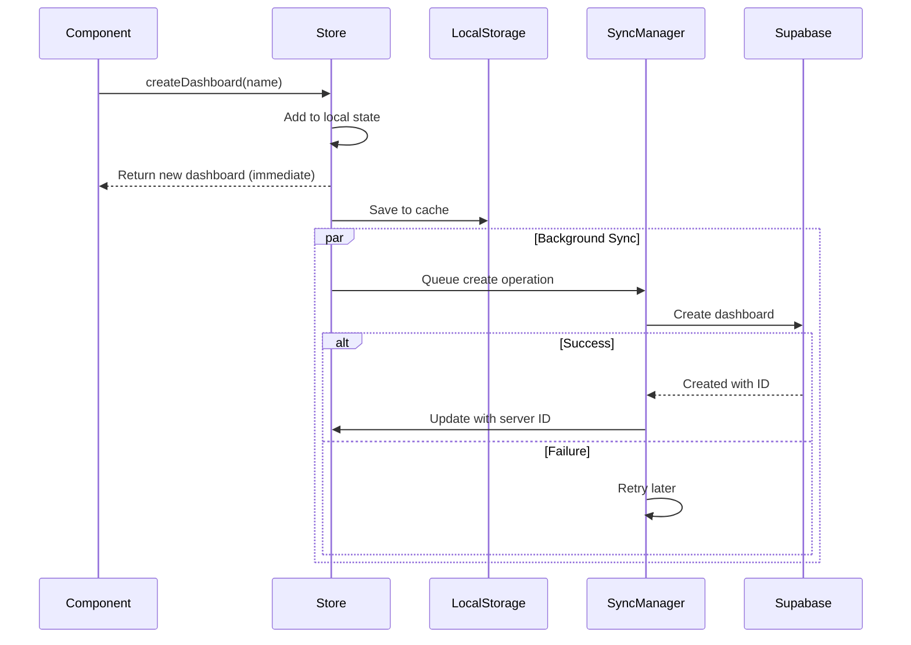
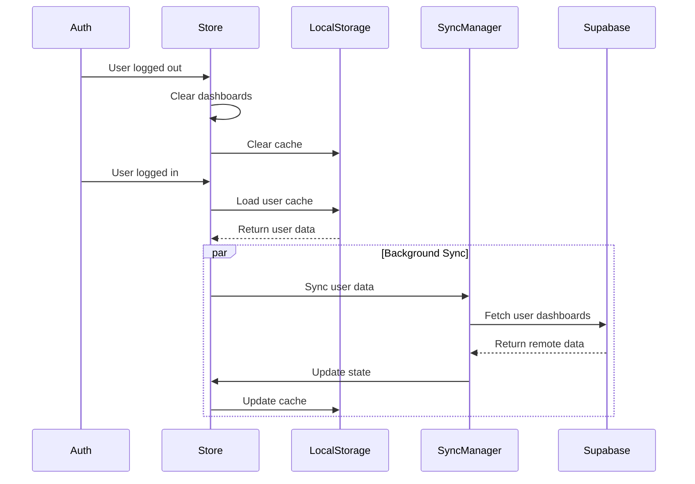

# Dashboard Lazy Sync Design

## Architecture Overview

The lazy sync approach maintains a **local-first architecture** with background synchronization to Supabase. The store remains the single source of truth, loading immediately from localStorage and syncing transparently in the background.



## Core Components

### 1. Enhanced Dashboard Store

The store maintains its synchronous API while internally managing background sync:

```typescript
interface DashboardState {
  // Existing synchronous state
  dashboards: Dashboard[];
  currentDashboard: Dashboard | null;
  templates: Dashboard[];
  
  // New: Sync status (optional for components)
  syncStatus: 'idle' | 'syncing' | 'error';
  lastSyncTime: Date | null;
  pendingOperations: number;
  
  // Existing synchronous methods (NO CHANGES)
  createDashboard: (name: string, description?: string) => Dashboard;
  updateDashboard: (id: string, updates: Partial<Dashboard>) => void;
  deleteDashboard: (id: string) => void;
  addWidget: (dashboardId: string, widget: Omit<Widget, 'id'>) => void;
  updateWidget: (dashboardId: string, widgetId: string, updates: Partial<Widget>) => void;
  removeWidget: (dashboardId: string, widgetId: string) => void;
  
  // New: Manual sync control (optional)
  forcSync: () => Promise<void>;
  clearSyncQueue: () => void;
}
```

### 2. Sync Manager

Internal component that handles all background synchronization:

```typescript
class SyncManager {
  private queue: SyncOperation[] = [];
  private isOnline = true;
  private syncTimer: NodeJS.Timeout | null = null;
  
  // Initialize sync on app load
  async initialize(): Promise<void> {
    this.loadFromLocalStorage();
    this.startPeriodicSync();
    this.listenToAuth();
    this.syncFromSupabase(); // Background
  }
  
  // Queue operations for background sync
  queueOperation(op: SyncOperation): void {
    this.queue.push(op);
    this.processSyncQueue(); // Background
  }
  
  // Process queued operations
  private async processSyncQueue(): Promise<void> {
    // Process in background without blocking UI
  }
}
```

### 3. Local Storage Manager

Handles persistent local storage with efficient serialization:

```typescript
class LocalStorageManager {
  private static DASHBOARDS_KEY = 'dashboard_store_v1';
  
  save(dashboards: Dashboard[]): void {
    localStorage.setItem(this.DASHBOARDS_KEY, JSON.stringify({
      dashboards,
      timestamp: Date.now(),
      version: 1
    }));
  }
  
  load(): Dashboard[] {
    const stored = localStorage.getItem(this.DASHBOARDS_KEY);
    if (!stored) return [];
    
    try {
      const data = JSON.parse(stored);
      return data.dashboards || [];
    } catch {
      return [];
    }
  }
}
```

## Data Flow Patterns

### 1. App Initialization Flow



### 2. Dashboard Creation Flow



### 3. Auth Change Flow



## Database Schema (Minimal Changes)

Since we're adding lazy sync, we need minimal Supabase schema:

```sql
-- Simple dashboards table with JSON widgets
CREATE TABLE public.dashboards (
    id uuid DEFAULT gen_random_uuid() PRIMARY KEY,
    user_id uuid NOT NULL REFERENCES auth.users(id) ON DELETE CASCADE,
    name text NOT NULL,
    description text,
    widgets jsonb NOT NULL DEFAULT '[]',
    is_published boolean DEFAULT false,
    is_template boolean DEFAULT false,
    created_at timestamptz DEFAULT now(),
    updated_at timestamptz DEFAULT now(),
    -- New: For conflict resolution
    version integer DEFAULT 1,
    last_modified_by uuid REFERENCES auth.users(id)
);

-- RLS Policies (same as before)
ALTER TABLE public.dashboards ENABLE ROW LEVEL SECURITY;

CREATE POLICY "Users can view own dashboards and templates"
ON public.dashboards FOR SELECT
USING (user_id = auth.uid() OR (is_template = true AND is_published = true));

-- Indexes for performance
CREATE INDEX idx_dashboards_user_id ON public.dashboards(user_id);
CREATE INDEX idx_dashboards_updated ON public.dashboards(updated_at);
```

## Sync Operations & Conflict Resolution

### Sync Operation Types

```typescript
type SyncOperation = 
  | { type: 'CREATE'; dashboard: Dashboard; localId: string }
  | { type: 'UPDATE'; id: string; changes: Partial<Dashboard> }
  | { type: 'DELETE'; id: string }
  | { type: 'FULL_SYNC'; timestamp: number };
```

### Conflict Resolution Strategy

1. **Simple Conflicts** (name, description changes): Last-write-wins
2. **Widget Conflicts**: Merge non-conflicting widgets, prompt for conflicts
3. **Structural Conflicts**: User chooses local or remote version
4. **Delete Conflicts**: Confirm with user before applying

## Error Handling & Retry Logic

### Network Error Handling

```typescript
class NetworkErrorHandler {
  async retryWithBackoff<T>(
    operation: () => Promise<T>,
    maxRetries = 3
  ): Promise<T> {
    for (let i = 0; i < maxRetries; i++) {
      try {
        return await operation();
      } catch (error) {
        if (i === maxRetries - 1) throw error;
        await this.delay(Math.pow(2, i) * 1000); // Exponential backoff
      }
    }
    throw new Error('Max retries exceeded');
  }
}
```

### Graceful Degradation

- **Supabase Down**: Continue with local data, queue operations
- **Auth Expired**: Refresh token, retry operations
- **Network Slow**: Continue locally, show sync pending indicator
- **Storage Full**: Clean old data, warn user

## Performance Considerations

### Local Storage Optimization

- **Lazy Loading**: Only load current user's dashboards
- **Compression**: JSON.stringify with minimal data
- **Debouncing**: Batch rapid changes before saving
- **Size Limits**: Implement cleanup for large datasets

### Background Sync Optimization

- **Batching**: Group multiple operations in single request
- **Differential Sync**: Only sync changed dashboards
- **Smart Timing**: Sync during idle periods
- **Request Deduplication**: Avoid duplicate requests

## Migration Strategy

### Phase 1: Add Sync Infrastructure

1. Create SyncManager and LocalStorageManager classes
2. Add sync status to store (optional fields)
3. Implement local storage persistence
4. Add Supabase schema

### Phase 2: Background Sync Layer

1. Implement background sync operations
2. Add periodic sync timer
3. Handle auth state changes
4. Test offline/online scenarios

### Phase 3: Gradual Rollout

1. Feature flag for lazy sync
2. A/B test with subset of users
3. Monitor performance and errors
4. Full rollout after validation

## Testing Strategy

### Unit Tests
- SyncManager operations
- Conflict resolution logic
- LocalStorage serialization
- Error handling scenarios

### Integration Tests
- End-to-end sync flows
- Auth state transitions
- Network error scenarios
- Multi-tab synchronization

### Performance Tests
- Large dashboard datasets
- Rapid operation sequences
- Background sync performance
- Memory usage monitoring 