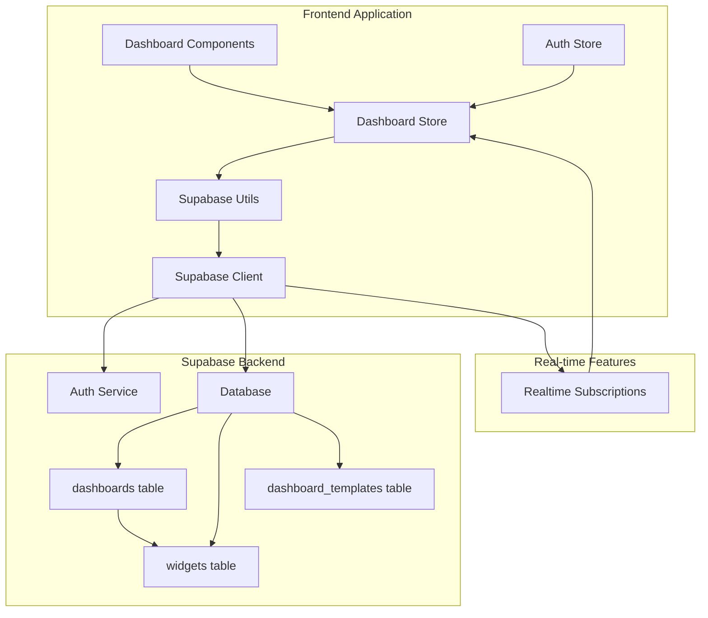

# Design Document

## Overview

This design outlines the migration of the dashboard management system from local Zustand state to a Supabase-backed architecture. The solution maintains the existing API surface while adding persistent storage, user data isolation, real-time synchronization, and multi-device support. The design leverages the existing Supabase infrastructure already used for authentication and thread management.

## Architecture

### High-Level Architecture



### Data Flow

1. **Authentication**: User authenticates via existing auth system
2. **Store Initialization**: Dashboard store fetches user's dashboards from Supabase
3. **CRUD Operations**: All dashboard/widget operations go through Supabase
4. **Real-time Sync**: Changes are synchronized across tabs/devices
5. **Template Management**: Templates are managed separately with proper permissions

## Components and Interfaces

### Database Schema

#### Dashboards Table
```sql
CREATE TABLE public.dashboards (
    id uuid DEFAULT gen_random_uuid() PRIMARY KEY,
    user_id uuid NOT NULL REFERENCES auth.users(id) ON DELETE CASCADE,
    name text NOT NULL,
    description text,
    widgets jsonb NOT NULL DEFAULT '[]',
    is_published boolean DEFAULT false,
    is_template boolean DEFAULT false,
    created_at timestamptz DEFAULT now(),
    updated_at timestamptz DEFAULT now()
);

-- RLS Policies
ALTER TABLE public.dashboards ENABLE ROW LEVEL SECURITY;

CREATE POLICY "Users can view their own dashboards and published templates"
ON public.dashboards FOR SELECT
USING (user_id = auth.uid() OR (is_template = true AND is_published = true));

CREATE POLICY "Users can insert their own dashboards"
ON public.dashboards FOR INSERT
WITH CHECK (user_id = auth.uid());

CREATE POLICY "Users can update their own dashboards"
ON public.dashboards FOR UPDATE
USING (user_id = auth.uid());

CREATE POLICY "Users can delete their own dashboards"
ON public.dashboards FOR DELETE
USING (user_id = auth.uid());

-- Index for performance
CREATE INDEX idx_dashboards_user_id ON public.dashboards(user_id);
CREATE INDEX idx_dashboards_templates ON public.dashboards(is_template, is_published) WHERE is_template = true;
```

### Updated TypeScript Interfaces

#### Enhanced Dashboard Interface
```typescript
// Minimal changes to existing Dashboard interface
export interface Dashboard {
  id: string;
  user_id?: string; // Added for Supabase integration
  name: string;
  description?: string;
  widgets: Widget[]; // Keep existing Widget array structure
  isPublished: boolean; // Keep existing camelCase naming
  isTemplate: boolean; // Keep existing camelCase naming
  createdAt: Date; // Keep existing Date objects
  updatedAt: Date; // Keep existing Date objects
}

// Widget interface remains unchanged - no database-specific fields needed
export interface Widget {
  id: string;
  type: 'chart' | 'table' | 'metric' | 'text';
  title: string;
  position: { x: number; y: number };
  size: { width: number; height: number };
  config: WidgetConfig;
}
```

### Supabase Utilities Extension

#### Dashboard Operations
```typescript
// src/utils/dashboardSupabaseUtils.ts
export async function fetchUserDashboards(): Promise<Dashboard[]>
export async function fetchTemplates(): Promise<Dashboard[]>
export async function createDashboard(dashboard: Omit<Dashboard, 'id' | 'user_id' | 'created_at' | 'updated_at'>): Promise<Dashboard>
export async function updateDashboard(id: string, updates: Partial<Dashboard>): Promise<Dashboard>
export async function deleteDashboard(id: string): Promise<void>
export async function publishDashboard(id: string): Promise<Dashboard>
export async function unpublishDashboard(id: string): Promise<Dashboard>
export async function createFromTemplate(templateId: string, name: string): Promise<Dashboard>
```

#### Data Transformation Utilities
```typescript
// Transform between frontend Dashboard format and Supabase format
export function transformToSupabase(dashboard: Dashboard): SupabaseDashboard
export function transformFromSupabase(supabaseDashboard: SupabaseDashboard): Dashboard
export function migrateExistingTemplates(): Promise<void>
```

### Enhanced Dashboard Store

#### Store Interface
```typescript
interface DashboardState {
  // State
  dashboards: Dashboard[];
  templates: Dashboard[];
  currentDashboard: Dashboard | null;
  isLoading: boolean;
  error: string | null;
  
  // Actions
  initializeStore: () => Promise<void>;
  createDashboard: (name: string, description?: string) => Promise<Dashboard>;
  updateDashboard: (id: string, updates: Partial<Dashboard>) => Promise<void>;
  deleteDashboard: (id: string) => Promise<void>;
  publishDashboard: (id: string) => Promise<void>;
  createFromTemplate: (templateId: string, name: string) => Promise<Dashboard>;
  
  // Widget actions
  addWidget: (dashboardId: string, widget: Omit<Widget, 'id' | 'user_id' | 'dashboard_id' | 'created_at' | 'updated_at'>) => Promise<void>;
  updateWidget: (dashboardId: string, widgetId: string, updates: Partial<Widget>) => Promise<void>;
  removeWidget: (dashboardId: string, widgetId: string) => Promise<void>;
  
  // Utility actions
  setCurrentDashboard: (dashboard: Dashboard | null) => void;
  clearError: () => void;
}
```

## Data Models

### Dashboard Storage Pattern

The system will follow the established pattern from thread management:

1. **Optimistic Updates**: UI updates immediately, then syncs to Supabase
2. **Error Handling**: Failed operations show toast notifications and revert UI
3. **Real-time Sync**: Supabase realtime subscriptions keep data synchronized
4. **Offline Support**: Operations queue when offline and sync when reconnected

### Template Management Strategy

Templates will be handled through the same dashboard table with special flags:

1. **System Templates**: Pre-created dashboards with `is_template: true` and `is_published: true`
2. **User Templates**: User dashboards that are published as templates
3. **Template Copying**: Creating from template copies all widgets with new IDs
4. **Template Updates**: Changes to templates don't affect derived dashboards

## Error Handling

### Error Categories

1. **Authentication Errors**: User not logged in or session expired
2. **Permission Errors**: Attempting to access unauthorized data
3. **Network Errors**: Connection issues or Supabase downtime
4. **Validation Errors**: Invalid data format or missing required fields
5. **Conflict Errors**: Concurrent modifications or constraint violations

### Error Handling Strategy

```typescript
// Error handling wrapper for all Supabase operations
async function handleSupabaseOperation<T>(
  operation: () => Promise<{ data: T | null; error: any }>,
  errorMessage: string
): Promise<T> {
  try {
    const { data, error } = await operation();
    
    if (error) {
      console.error(`${errorMessage}:`, error);
      toast.error(`${errorMessage}: ${error.message}`);
      throw new Error(error.message);
    }
    
    if (!data) {
      throw new Error('No data returned from operation');
    }
    
    return data;
  } catch (error) {
    console.error(`${errorMessage}:`, error);
    toast.error(`${errorMessage}: ${error instanceof Error ? error.message : 'Unknown error'}`);
    throw error;
  }
}
```

## Testing Strategy

### Unit Testing

1. **Supabase Utils Testing**: Mock Supabase client and test all CRUD operations
2. **Store Testing**: Test store actions with mocked Supabase utilities
3. **Component Testing**: Test dashboard components with mocked store
4. **Error Handling Testing**: Test error scenarios and recovery

### Integration Testing

1. **End-to-End Dashboard Flow**: Create, edit, delete dashboard workflows
2. **Template System**: Test template creation, copying, and publishing
3. **Multi-User Scenarios**: Test data isolation and permissions
4. **Real-time Sync**: Test cross-tab synchronization

### Migration Testing

1. **Data Migration**: Test migration of existing local data to Supabase
2. **Backward Compatibility**: Ensure existing components work with new store
3. **Performance Testing**: Test with large numbers of dashboards and widgets
4. **Offline/Online Scenarios**: Test offline queue and sync behavior

## Migration Strategy

### Phase 1: Database Setup
1. Create Supabase tables and policies
2. Set up RLS and security rules
3. Create database indexes for performance

### Phase 2: Utility Layer
1. Implement dashboard Supabase utilities
2. Add error handling and validation
3. Set up real-time subscriptions

### Phase 3: Store Migration
1. Update dashboard store to use Supabase
2. Maintain existing API surface
3. Add loading states and error handling

### Phase 4: Data Migration
1. Create migration script for existing data
2. Handle template conversion
3. Test data integrity

### Phase 5: Testing and Deployment
1. Comprehensive testing
2. Performance optimization
3. Gradual rollout with feature flags