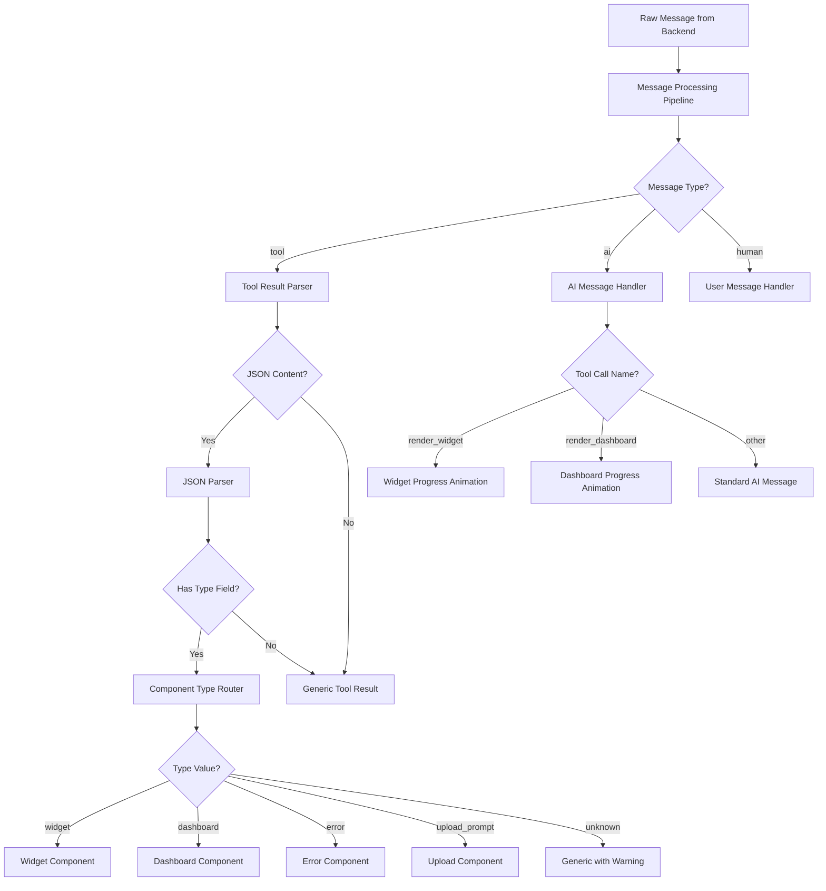

# Design Document

## Overview

This design enhances the chat interface's message processing system to intelligently parse and render different types of tool results. The system will analyze JSON content from tool results, identify specific component types, and render them using appropriate specialized components. Additionally, it includes visual enhancements for loading states and progress indicators for complex operations.

## Architecture

### High-Level Flow



## Components and Interfaces

### 1. Enhanced Message Parser

**Location:** `src/utils/messageUtils.ts`

```typescript
interface ParsedToolResult {
  type: 'widget' | 'dashboard' | 'error' | 'upload_prompt' | 'generic';
  data: any;
  originalContent: any;
  parseError?: string;
}

interface ProgressStepConfig {
  name: string;
  steps: string[];
  duration: number;
}

// Enhanced parsing function
function parseToolResultContent(content: any): ParsedToolResult
function shouldShowProgress(message: Message, isLoading: boolean, isLastMessage: boolean): boolean
function getProgressConfig(toolName: string): ProgressStepConfig | null
```

### 2. Component Type Router

**Location:** `src/utils/componentRouter.ts`

```typescript
interface ComponentRouterResult {
  componentType: AIComponent['type'];
  componentData: any;
  fallbackToGeneric: boolean;
  warningMessage?: string;
}

function routeToolResultToComponent(parsedResult: ParsedToolResult): ComponentRouterResult
```

### 3. Progress Animation Component

**Location:** `src/components/chat/ProgressAnimation.tsx`

```typescript
interface ProgressAnimationProps {
  steps: string[];
  duration?: number;
  onComplete?: () => void;
}

interface ProgressStepProps {
  step: string;
  isActive: boolean;
  isCompleted: boolean;
}
```

### 4. Enhanced Input Area

**Location:** `src/components/chat/InputArea.tsx`

```typescript
interface InputAreaProps {
  input: string;
  setInput: (value: string) => void;
  handleSend: () => void;
  isLoading: boolean;
  error: any;
}

// CSS classes for animations
.loading-border-animation
.pulse-border
.moving-border-shadow
```

## Data Models

### Enhanced Message Processing

```typescript
// Extended AIComponent type to include parsing metadata
interface EnhancedAIComponent extends AIComponent {
  parseMetadata?: {
    originalContent: any;
    parseError?: string;
    fallbackReason?: string;
  };
}

// Progress tracking for complex operations
interface ProgressState {
  isActive: boolean;
  toolName: string;
  currentStep: number;
  steps: string[];
  startTime: number;
}
```

### Tool Result Schemas

```typescript
// Validation schemas for different tool result types
interface WidgetToolResult {
  type: 'widget';
  id: string;
  data: {
    widget: Widget;
    query?: string;
    table_names?: string[];
    show_sql?: boolean;
  };
}

interface DashboardToolResult {
  type: 'dashboard';
  id: string;
  data: {
    dashboard: Dashboard;
    previewMode?: boolean;
  };
}

interface ErrorToolResult {
  type: 'error';
  id: string;
  data: {
    error: string;
    code?: string;
    suggestions?: string[];
    stack_trace?: string;
  };
}

interface UploadPromptToolResult {
  type: 'upload_prompt';
  id: string;
  data: {
    message: string;
    acceptedTypes: string[];
    targetTable?: string;
  };
}
```

## Error Handling

### Parsing Error Strategy

1. **JSON Parse Failure**: Fall back to generic tool result display
2. **Missing Type Field**: Display as generic with informational message
3. **Unknown Type**: Display as generic with warning badge
4. **Invalid Data Structure**: Log error, show generic with error indicator
5. **Component Render Failure**: Catch and display error boundary

### Error Recovery

```typescript
interface ErrorBoundaryState {
  hasError: boolean;
  errorMessage: string;
  fallbackComponent: 'generic' | 'error';
}

class ToolResultErrorBoundary extends React.Component<Props, ErrorBoundaryState>
```

## Testing Strategy

### Unit Tests

1. **Message Parser Tests**
   - Valid JSON parsing for each component type
   - Invalid JSON handling
   - Missing type field scenarios
   - Unknown type handling

2. **Component Router Tests**
   - Correct component type routing
   - Fallback behavior validation
   - Warning message generation

3. **Progress Animation Tests**
   - Step progression timing
   - Animation lifecycle management
   - Cleanup on component unmount

### Integration Tests

1. **End-to-End Message Flow**
   - Backend message → parsed component → rendered UI
   - Error scenarios and fallback behavior
   - Progress animation triggers and cleanup

2. **Visual Regression Tests**
   - Input area loading animations
   - Progress step animations
   - Component rendering consistency

## Implementation Phases

### Phase 1: Core Parsing Infrastructure
- Implement enhanced message parser
- Create component type router
- Add error handling and fallback mechanisms

### Phase 2: Component Integration
- Update convertToEnhancedMessage function
- Integrate with existing AIComponentRenderer
- Add parsing metadata to components

### Phase 3: Visual Enhancements
- Implement input area loading animations
- Create progress animation component
- Add CSS animations and transitions

### Phase 4: Testing and Optimization
- Comprehensive test coverage
- Performance optimization
- Error boundary implementation

## Performance Considerations

### JSON Parsing Optimization
- Cache parsed results for identical content
- Use try-catch blocks efficiently
- Minimize re-parsing on re-renders

### Animation Performance
- Use CSS transforms for smooth animations
- Implement requestAnimationFrame for complex animations
- Clean up animation timers on component unmount

### Memory Management
- Clear cached parsing results periodically
- Prevent memory leaks in progress animations
- Optimize component re-rendering

## Security Considerations

### Input Validation
- Sanitize JSON content before parsing
- Validate component data structures
- Prevent XSS through content injection

### Error Information Exposure
- Limit error details in production
- Sanitize stack traces
- Avoid exposing internal system information